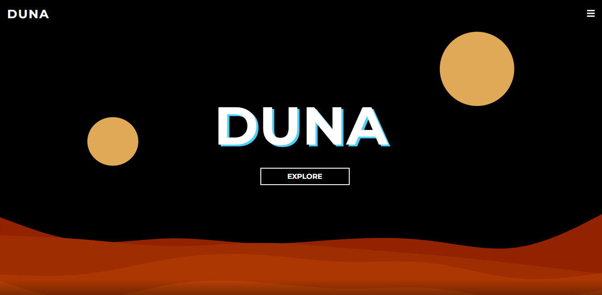

# Duna

## 🎯 Objetivo

Esta é uma aplicação sobre o livro e filme de Duna, e contém descrições sobre cada personagem.

## 📚 Páginas

O site é composto por 3 sessões diferentes:

- Home;
- Página individual para cada Casa;
- Página individual para cada Personagem;
- Página de pesquisa sobre Terminologias;
- Página de pesquisa sobre a Geografia de Arrakis;
## 🛠️ Tecnologias utilizadas

Para o desenvolvimento deste site utilizei as seguintes tecnologias:

- React JS;
- Next JS;
- CSS Modules;
- React Icons;

## 🚀 Como executar o projeto

1. Clone este repositório

`$ https://github.com/giovanaraphaelli/duna.git`

2. Acesse a pasta do projeto no seu terminal/cmd

`$ cd duna`

3. Abra a pasta do projeto no VS Code via terminal/cmd

`$ code .`

4. Instale as dependências

`$ yarn install`

5. Execute a aplicação em modo de desenvolvimento

`$ yarn dev`

6. A aplicação será aberta na porta: 3000 - acesse http://localhost:3000
